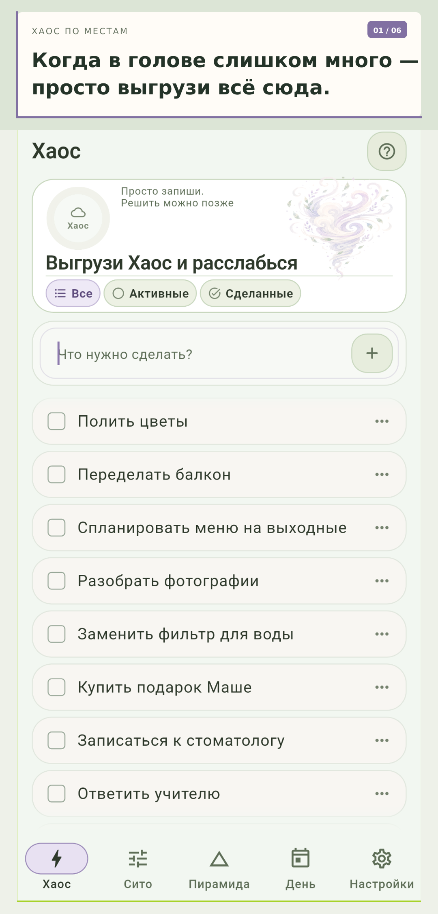
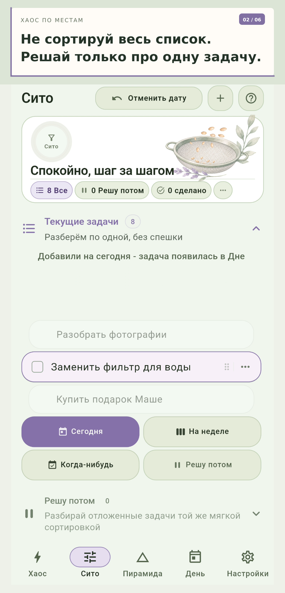
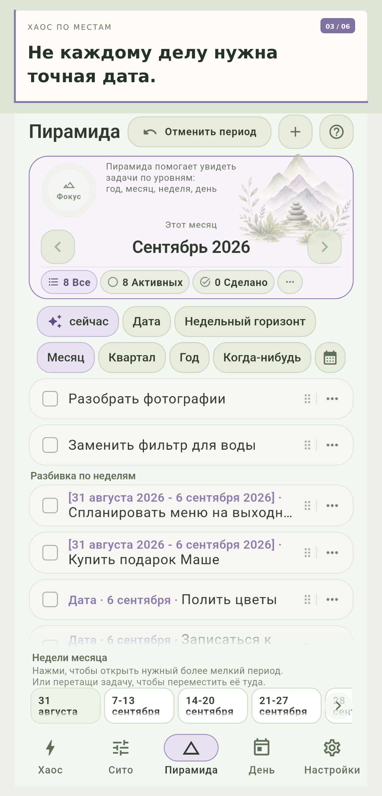
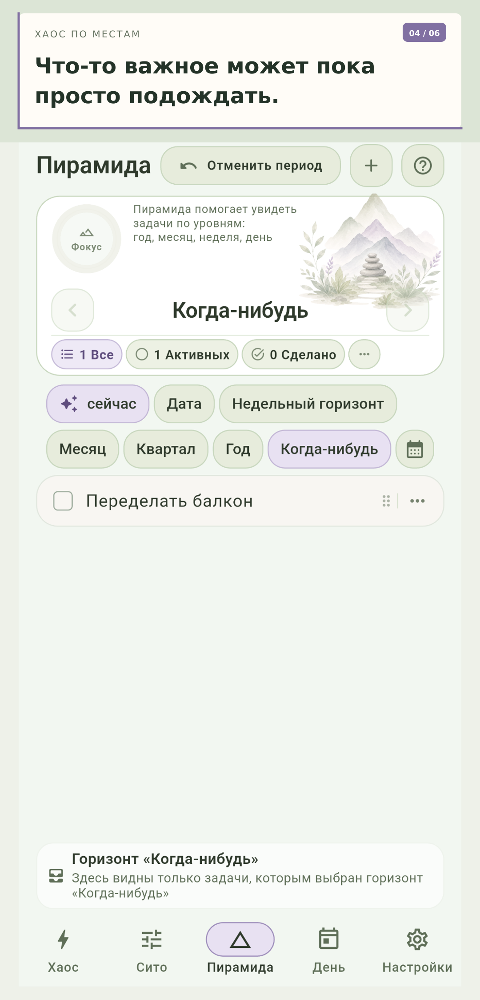
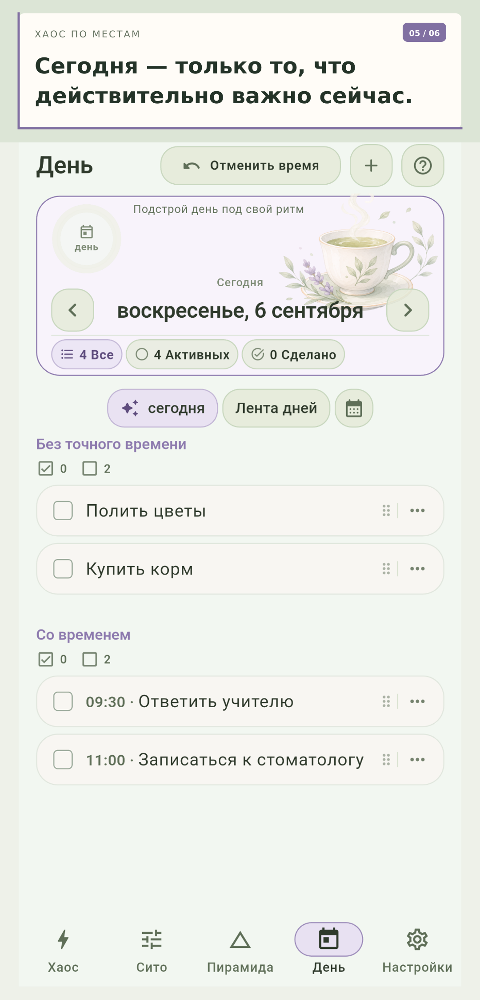
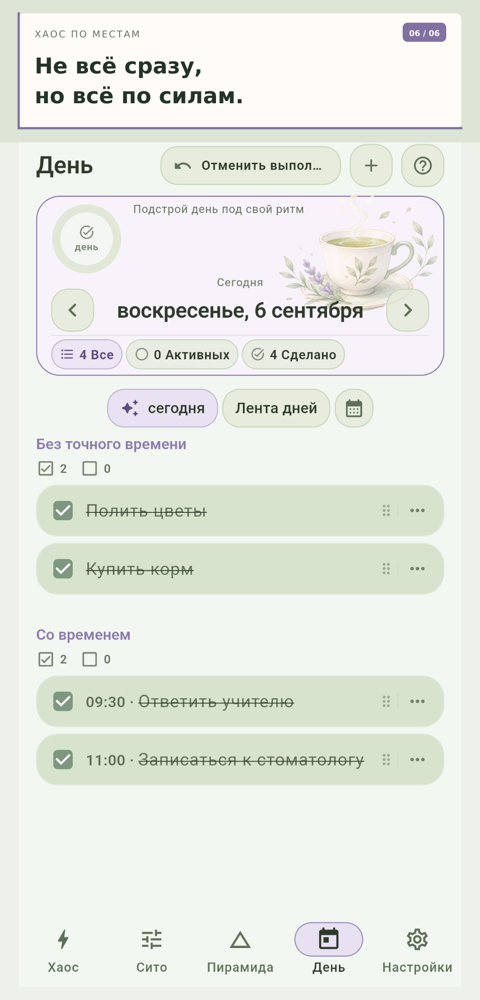

# Хаос по местам

Спокойный планировщик, который помогает сначала разгрузить голову, а затем постепенно разложить дела по времени — без необходимости планировать всё сразу.

> Сейчас доступна бета-версия для Android. Репозиторий содержит готовые сборки приложения и материалы релизов. Исходный код здесь не публикуется.

## Как это работает

### 1. Выгрузите всё из головы

Добавляйте дела в «Хаос» быстро и без предварительной сортировки.

### 2. Принимайте одно решение за раз

«Сито» показывает одну задачу и помогает решить, что делать с ней дальше: перенести на сегодня, неделю, когда-нибудь или отложить решение.

### 3. Планируйте с удобной точностью

В «Пирамиде» можно выбрать подходящий горизонт: день, неделю, месяц, квартал, год или «Когда-нибудь».

### 4. Соберите спокойный план дня

Назначайте точное время только тем задачам, которым оно действительно нужно.

## Короткая демонстрация

Видео с основным сценарием работы приложения приложено к последнему релизу:

[▶ Смотреть демонстрацию приложения](https://github.com/NoveltiL/haospomestam-releases/releases/download/v1.0.0-beta.1%2B38/haos-po-mestam-demo-1.0.0-beta.1-build.38.mp4)

## Скачать

Откройте раздел [Releases](https://github.com/NoveltiL/haospomestam-releases/releases) и выберите APK последней опубликованной версии.

Для проверки загруженного файла рядом с APK публикуется `SHA256SUMS.txt`.

## Установка на Android

1. Скачайте APK из GitHub Releases.
2. При необходимости разрешите установку приложений из выбранного браузера или файлового менеджера.
3. Откройте APK и подтвердите установку.

При обновлении устанавливайте новую версию поверх существующей, не удаляя приложение, чтобы сохранить локальные данные.

## Статус проекта

Приложение находится на стадии бета-тестирования. Перед обновлением важных данных рекомендуется иметь актуальную резервную копию.
